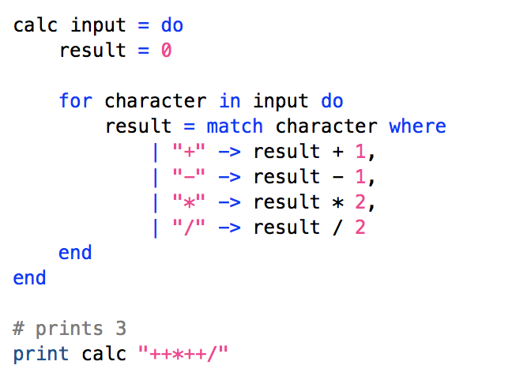

<h1 align="center">Radon</h1>

This is a total rewrite of Radon, with more focus on code quality, testing, and some slight improvements to the actual language. The old version has [its own branch](https://github.com/zac-garby/radon/tree/old). This is still a work in progress, so I can't at all guarantee that it works. In fact, I can probably guarantee more that it _won't_.

For syntax highlighting and snippets in [TextMate](http://macromates.com), install [Radon.tmbundle](Radon.tmbundle) from this repository.

Here's a nice example of some of the features:

##### What's implemented so far?

 - The AST
   - Tested
 - The lexer
   - Tested
 - The parser
   - Tested
 - All objects (except functions)
   - Tested
 - Bytecode
   - Defined all instructions
   - Parsing instructions
   - Tested